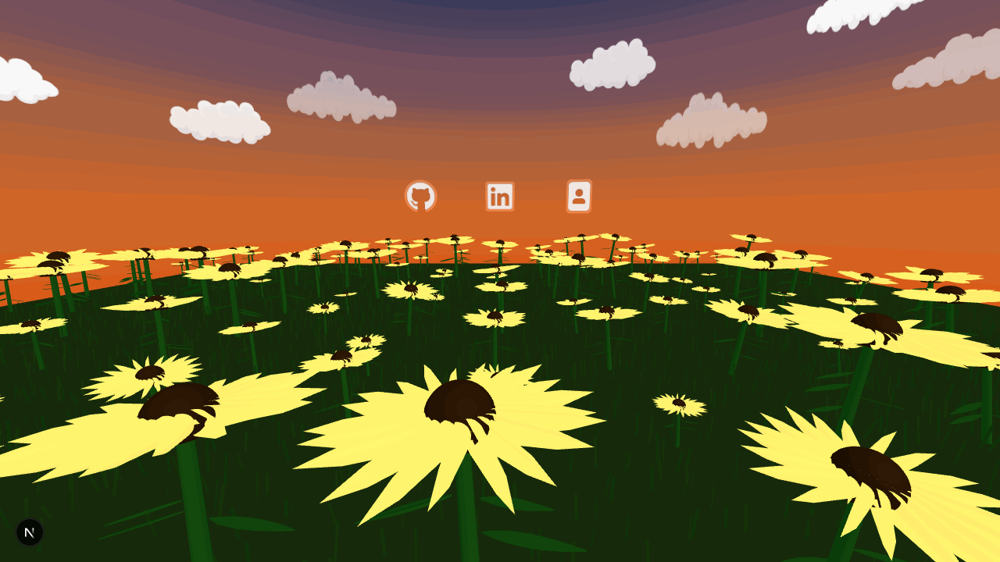
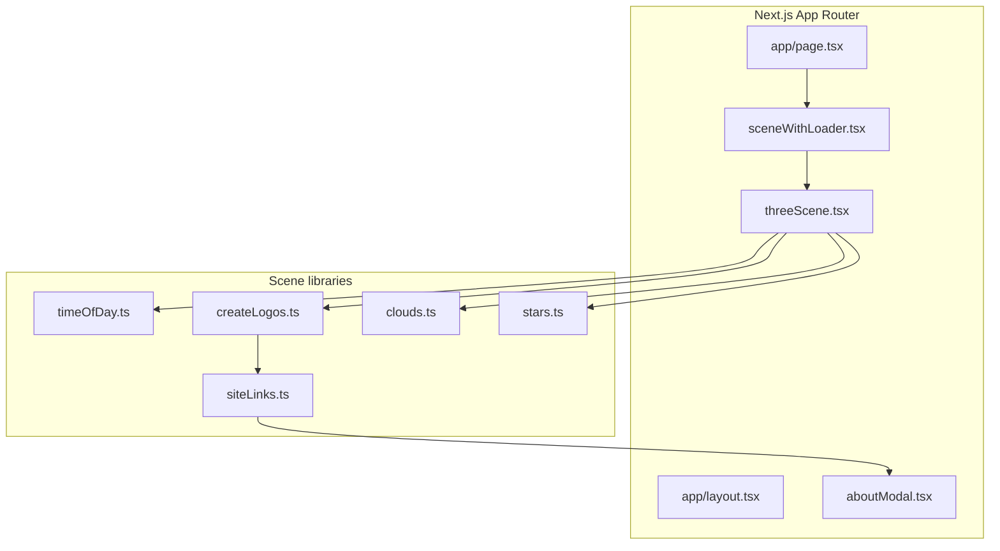

# adamarys — interactive 3D personal site

> A single-page sunflower meadow built with Next.js and Three.js. Sky, lighting, and stars follow the visitor's local time.

[](https://nextjs.org/)
[](https://threejs.org/)
[](https://www.typescriptlang.org/)



This repo powers my personal site: a single-page 3D sunflower field where the sky transitions through dawn, day, dusk, and night based on the visitor's local time. It's built with Next.js 16 (App Router) and Three.js, with procedural geometry and a small set of focused modules under `lib/`.

## Highlights

- **Time-of-day sky** — 24h gradient shader in [`lib/timeOfDay.ts`](lib/timeOfDay.ts); drives sky color, lighting, and star visibility
- **Procedural scene** — flowers, grass, clouds, and stars generated in [`app/components/threeScene.tsx`](app/components/threeScene.tsx) (no external 3D models)
- **Interactive social layer** — 3D GitHub/LinkedIn icons + HTML overlay links from [`lib/createLogos.ts`](lib/createLogos.ts); About opens [`app/components/aboutModal.tsx`](app/components/aboutModal.tsx)
- **Responsive performance** — entity counts and pixel ratio scale by viewport; full Three.js cleanup on unmount
- **Branded loader** — minimum display + fade orchestrated in [`app/components/sceneWithLoader.tsx`](app/components/sceneWithLoader.tsx)

## Architecture



[`app/page.tsx`](app/page.tsx) renders a single route. [`sceneWithLoader.tsx`](app/components/sceneWithLoader.tsx) waits for scene initialization and enforces loader timing. [`threeScene.tsx`](app/components/threeScene.tsx) owns the WebGL lifecycle — renderer, camera, animation loop, resize handling, and cleanup. [`lib/`](lib/) holds isolated concerns: sky/time, clouds, stars, clickable logos, and external link config in [`siteLinks.ts`](lib/siteLinks.ts).

## Project structure

| Path | Responsibility |
|------|----------------|
| `app/page.tsx` | Single-page entry |
| `app/components/threeScene.tsx` | Main Three.js scene |
| `app/components/sceneWithLoader.tsx` | Loader + scene handoff |
| `app/components/aboutModal.tsx` | About bio modal |
| `lib/timeOfDay.ts` | Sky shader + time-based lighting |
| `lib/createLogos.ts` | 3D social icons + DOM overlays |
| `lib/clouds.ts` | Procedural cloud sprites |
| `lib/stars.ts` | Point-cloud stars (night only) |
| `lib/siteLinks.ts` | Centralized link config |
| `public/icons/` | Social icon textures |

## Local development

```bash
npm install
npm run dev
# → http://localhost:3000
```

**Preview a specific time of day** — lock the sky to any hour (0–23):

```
http://localhost:3000?hour=19
```

Other scripts:

```bash
npm run build   # production build
npm run start   # serve production build
npm run lint    # ESLint
```

## Implementation notes

- **Single route by design** — immersive homepage, not a multi-page site
- **Client-side 3D** — Three.js runs in a client component; Next.js handles shell, fonts, and metadata
- **Time sync** — sky uses the visitor's local clock; `?hour=` overrides for dev preview
- **Accessibility** — `aria-label` on links/modal, Escape to close, `100svh` on mobile
- **Assets** — 2D textures only (`public/images/`, `public/icons/`); geometry is procedural
.
